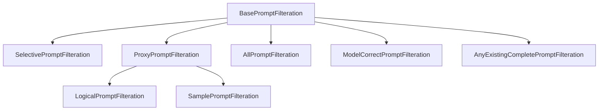

# Prompt Filteration System

This document provides a comprehensive guide to the prompt filteration infrastructure, which controls which prompts are used in experiments based on various criteria.

## Overview

The prompt filteration system provides flexible filtering of prompts for experiments through:

- **Base Classes**: Abstract interfaces for different filteration types
- **Logical Operations**: AND, OR, NOT operations between filters
- **Context Awareness**: Integration with experiment runners and dependencies
- **Factory Pattern**: Centralized creation and management
- **Sampling**: Random and deterministic sampling capabilities

## Architecture

### Core Components



## Base Classes

### `BasePromptFilteration`

The abstract base class for all prompt filterations:

```python
@dataclass(frozen=True)
class BasePromptFilteration(BaseParams, JSONAble):
    """Filteration of prompts to run the experiment on."""
    
    _context: Optional[Any] = field(default=None, init=False)
    
    @abstractmethod
    def get_prompt_ids(self) -> list[TPromptOriginalIndex]:
        """Return list of prompt IDs that pass the filter."""
        pass
    
    @abstractmethod
    def get_dependencies(self) -> TDependencies:
        """Return experiment dependencies needed for filtering."""
        pass
    
    @abstractmethod
    def display_name(self) -> str:
        """Human-readable description of the filter."""
        pass
```

**Key Features**:
- **Context Awareness**: Can be contextualized with runner information
- **Dependency Management**: Integrates with experiment dependency system
- **Operator Overloading**: Supports `&` (AND), `|` (OR), `~` (NOT) operations
- **Immutability**: Frozen dataclass for thread safety

### `ProxyPromptFilteration`

Base class for filterations that delegate to other filterations:

```python
@dataclass(frozen=True)
class ProxyPromptFilteration(BasePromptFilteration, ABC):
    @abstractmethod
    def _get_prompt_ids(
        self, get_prompt_ids: Callable[[BasePromptFilteration], list[TPromptOriginalIndex]]
    ) -> list[TPromptOriginalIndex]:
        """Implement filtering logic with access to contextualized sub-filterations."""
        pass
```

**Use Cases**:
- **Logical Operations**: Combining multiple filters
- **Sampling**: Applying sampling to base filters
- **Context Propagation**: Ensuring context flows to sub-filters

## Concrete Implementations

### 1. `AllPromptFilteration`

Returns all prompts from a dataset:

```python
@dataclass(frozen=True)
class AllPromptFilteration(BasePromptFilteration):
    dataset_name: DatasetName = DatasetName.counter_fact
    split: TSplitChoise = ALL_SPLITS_LITERAL
    
    def get_prompt_ids(self) -> list[TPromptOriginalIndex]:
        return get_prompt_ids(self.dataset_name, self.split)
```

**Usage**:
```python
# All prompts from counter_fact dataset
all_filter = AllPromptFilteration(
    dataset_name=DatasetName.counter_fact,
    split=ALL_SPLITS_LITERAL
)

# Only training split
train_filter = AllPromptFilteration(
    dataset_name=DatasetName.counter_fact,
    split=SPLIT.TRAIN1
)
```

### 2. `SelectivePromptFilteration`

Returns a specific set of prompt IDs:

```python
@dataclass(frozen=True)
class SelectivePromptFilteration(BasePromptFilteration):
    prompt_ids: tuple[TPromptOriginalIndex, ...]
    
    def display_name(self) -> str:
        amount = len(self.prompt_ids)
        if amount > 5:
            return f"Selective ({amount})"
        else:
            return f"Selective ({', '.join(str(prompt_id) for prompt_id in self.prompt_ids)})"
```

**Usage**:
```python
# Specific prompt IDs for testing
selective_filter = SelectivePromptFilteration(
    prompt_ids=(53, 59, 74, 90, 93)
)
```

### 3. `ModelCorrectPromptFilteration`

Returns prompts where a specific model gives correct answers:

```python
@dataclass(frozen=True)
class ModelCorrectPromptFilteration(BasePromptFilteration):
    dataset_name: DatasetName
    model_arch_and_size: Optional[MODEL_ARCH_AND_SIZE]
    correctness: Correctness
    code_version: TCodeVersionName
```

**Correctness Types**:
```python
class Correctness(StrEnum):
    correct = "correct"                    # Exact match (rank 1)
    top_5_correct = "top_5_correct"       # Top 5 predictions
    top_3_correct = "top_3_correct"       # Top 3 predictions  
    top_2_to_5_correct = "top_2_to_5_correct"  # Ranks 2-5
```

**Usage**:
```python
# Prompts where GPT-2 355M gives correct answers
correct_filter = ModelCorrectPromptFilteration(
    dataset_name=DatasetName.counter_fact,
    model_arch_and_size=MODEL_ARCH_AND_SIZE(MODEL_ARCH.GPT2, TModelSize("355M")),
    correctness=Correctness.correct,
    code_version=TCodeVersionName("v1.0")
)

# Context-aware version (gets model from runner context)
context_filter = ModelCorrectPromptFilteration(
    dataset_name=DatasetName.counter_fact,
    model_arch_and_size=None,  # Will use context
    correctness=Correctness.top_5_correct,
    code_version=TCodeVersionName("v1.0")
)
```

**Dependencies**: 
Automatically creates `EvaluateModelRunner` dependency to get model correctness data.

### 4. `AnyExistingCompletePromptFilteration`

Returns prompts that have been successfully processed by previous experiments:

```python
@dataclass(frozen=True) 
class AnyExistingCompletePromptFilteration(BasePromptFilteration):
    def get_prompt_ids(self) -> list[TPromptOriginalIndex]:
        base_runner = self._get_base_runner_from_context()
        
        if isinstance(base_runner, EvaluateModelRunner):
            return base_runner.get_outputs()[COLS.ORIGINAL_IDX].tolist()
        elif isinstance(base_runner, InfoFlowRunner):
            return list(base_runner.output_file.get_computed_prompt_idx())
        elif isinstance(base_runner, HeatmapRunner):
            return list(base_runner.output_hdf5_path.get_existing_prompt_idx())
```

**Usage**:
```python
# Must be contextualized with a runner
existing_filter = AnyExistingCompletePromptFilteration()
contextualized_filter = existing_filter.contextualize(some_runner)
```

## Logical Operations

### `LogicalPromptFilteration`

Supports logical operations between filters:

```python
class LogicalOperationType(StrEnum):
    AND = "AND"    # Intersection
    OR = "OR"      # Union  
    NOT = "NOT"    # Complement
```

### Creating Logical Filters

#### Method 1: Factory Methods
```python
# AND operation (intersection)
and_filter = LogicalPromptFilteration.create_and([filter1, filter2, filter3])

# OR operation (union)
or_filter = LogicalPromptFilteration.create_or([filter1, filter2])

# NOT operation (complement)
not_filter = LogicalPromptFilteration.create_not(filter1, universe=all_filter)
```

#### Method 2: Operator Overloading
```python
# Using & operator for AND
combined_filter = filter1 & filter2 & filter3

# Using | operator for OR
union_filter = filter1 | filter2

# Using ~ operator for NOT (requires universe)
not_filter = ~filter1.with_universe(all_filter)
```

#### Method 3: Fluent Interface
```python
# Chaining operations
complex_filter = (filter1
    .and_with(filter2)
    .or_with(filter3)
    .not_op(universe=all_filter))
```

### Logical Operation Examples

```python
# Prompts correct for both GPT-2 and Mamba
gpt2_correct = ModelCorrectPromptFilteration(
    dataset_name=DatasetName.counter_fact,
    model_arch_and_size=MODEL_ARCH_AND_SIZE(MODEL_ARCH.GPT2, TModelSize("355M")),
    correctness=Correctness.correct,
    code_version=TCodeVersionName("v1.0")
)

mamba_correct = ModelCorrectPromptFilteration(
    dataset_name=DatasetName.counter_fact,
    model_arch_and_size=MODEL_ARCH_AND_SIZE(MODEL_ARCH.MAMBA1, TModelSize("130M")),
    correctness=Correctness.correct,
    code_version=TCodeVersionName("v1.0")
)

# AND: Prompts correct for both models
both_correct = gpt2_correct & mamba_correct

# OR: Prompts correct for either model  
either_correct = gpt2_correct | mamba_correct

# NOT: Prompts GPT-2 gets wrong
all_prompts = AllPromptFilteration(dataset_name=DatasetName.counter_fact)
gpt2_wrong = (~gpt2_correct).with_universe(all_prompts)
```

## Sampling

### `SamplePromptFilteration`

Apply random sampling to any base filter:

```python
@dataclass(frozen=True)
class SamplePromptFilteration(ProxyPromptFilteration):
    base_prompt_filteration: BasePromptFilteration
    sample_size: int
    seed: int
```

**Usage**:
```python
# Sample 100 prompts from all correct prompts
all_correct = ModelCorrectPromptFilteration(...)
sampled = SamplePromptFilteration(
    base_prompt_filteration=all_correct,
    sample_size=100,
    seed=42  # Deterministic sampling
)

# Sample from logical combination
complex_filter = filter1 & filter2 | filter3
sampled_complex = SamplePromptFilteration(
    base_prompt_filteration=complex_filter,
    sample_size=50,
    seed=123
)
```

## Factory Pattern

### `PromptFilterationFactory`

Centralized creation and management of filterations:

```python
from src.analysis.experiment_results.prompt_filteration_factory import (
    FilterationSource,
    get_prompt_filteration
)

class FilterationSource(StrEnum):
    preset = "preset"                    # Predefined configurations
    current_model = "current_model"      # Model correctness from context
    context_models = "context_models"    # Multiple model correctness
    all_important_models = "all_important_models"  # Predefined model set
    existing_prompts = "existing_prompts"  # Previously processed prompts
```

**Usage**:
```python
# Get filteration from factory
filteration = get_prompt_filteration(
    source=FilterationSource.current_model,
    correctness=Correctness.correct,
    context=some_runner
)

# Preset configurations
preset_filteration = get_prompt_filteration(
    source=FilterationSource.preset,
    preset_name="high_accuracy_subset"
)
```

## Context System

### Context Propagation

Filterations can be contextualized with runner information:

```python
# Create context-aware filteration
base_filter = ModelCorrectPromptFilteration(
    dataset_name=DatasetName.counter_fact,
    model_arch_and_size=None,  # Will get from context
    correctness=Correctness.correct,
    code_version=TCodeVersionName("v1.0")
)

# Contextualize with runner
runner = EvaluateModelRunner(...)
contextualized = base_filter.contextualize(runner)

# Context is automatically propagated in logical operations
complex_filter = base_filter & other_filter
contextualized_complex = complex_filter.contextualize(runner)
```

### Context Usage Patterns

```python
class InfoFlowRunner(BaseRunner):
    def get_runner_dependencies(self) -> TDependencies:
        # Filteration automatically gets runner context
        filteration = self.input_params.filteration.contextualize(self)
        
        return {
            "evaluate_model": filteration.get_dependencies(),
            "heatmap": {...}
        }
```

## Integration with Experiments

### Experiment Runner Integration

```python
@dataclass(frozen=True)
class InputParams(BaseParams):
    filteration: BasePromptFilteration
    dataset_name: DatasetName = DatasetName.counter_fact

class BaseRunner(BaseParams, ABC, Generic[_TVariantParams]):
    input_params: InputParams
    
    def get_runner_dependencies(self) -> TDependencies:
        # Contextualize filteration and get its dependencies
        contextualized = self.input_params.filteration.contextualize(self)
        return contextualized.get_dependencies()
```

### Full Pipeline Example

```python
# Create complex filteration for full pipeline
heatmap_prompts = SelectivePromptFilteration(
    prompt_ids=(53, 59, 74, 90, 93)  # Specific test prompts
)

model_correct_prompts = ModelCorrectPromptFilteration(
    dataset_name=DatasetName.counter_fact,
    model_arch_and_size=MODEL_ARCH_AND_SIZE(MODEL_ARCH.GPT2, TModelSize("355M")),
    correctness=Correctness.correct,
    code_version=TCodeVersionName("v1.0")
)

# Sample from correct prompts for main analysis
main_filteration = SamplePromptFilteration(
    base_prompt_filteration=model_correct_prompts,
    sample_size=1000,
    seed=42
)

# Create runner with filteration
runner = FullPipelineRunner(
    variant_params=FullPipelineParams(
        model_arch=MODEL_ARCH.MAMBA1,
        model_size=TModelSize("130M"),
        heatmap_prompts=heatmap_prompts,  # Specific prompts for heatmap
        # ... other params
    ),
    input_params=InputParams(
        filteration=main_filteration,  # Main experiment filteration
        dataset_name=DatasetName.counter_fact
    ),
    metadata_params=MetadataParams(
        code_version=TCodeVersionName("v1.0")
    )
)
```

## Advanced Usage Patterns

### 1. Multi-Model Consensus

```python
def get_shared_models_correctness_prompt_filteration(
    model_arch_and_sizes: Iterable[MODEL_ARCH_AND_SIZE],
    correctness: Correctness,
    code_version: TCodeVersionName,
    dataset_name: DatasetName
):
    """Get prompts that all specified models answer correctly."""
    model_filterations = []
    for model_arch_and_size in model_arch_and_sizes:
        model_filter = ModelCorrectPromptFilteration(
            dataset_name=dataset_name,
            model_arch_and_size=model_arch_and_size,
            correctness=correctness,
            code_version=code_version,
        )
        model_filterations.append(model_filter)
    
    return LogicalPromptFilteration.create_and(model_filterations)

# Usage
models = [
    MODEL_ARCH_AND_SIZE(MODEL_ARCH.GPT2, TModelSize("355M")),
    MODEL_ARCH_AND_SIZE(MODEL_ARCH.MAMBA1, TModelSize("130M")),
    MODEL_ARCH_AND_SIZE(MODEL_ARCH.LLAMA3_2, TModelSize("1B"))
]

consensus_filter = get_shared_models_correctness_prompt_filteration(
    model_arch_and_sizes=models,
    correctness=Correctness.correct,
    code_version=TCodeVersionName("v1.0"),
    dataset_name=DatasetName.counter_fact
)
```

### 2. Progressive Filtering

```python
# Start with all prompts
all_prompts = AllPromptFilteration(dataset_name=DatasetName.counter_fact)

# Filter to model-correct prompts
correct_prompts = ModelCorrectPromptFilteration(
    dataset_name=DatasetName.counter_fact,
    model_arch_and_size=None,  # Context-aware
    correctness=Correctness.correct,
    code_version=TCodeVersionName("v1.0")
)

# Filter to existing computed prompts
existing_prompts = AnyExistingCompletePromptFilteration()

# Combine: correct AND existing
available_prompts = correct_prompts & existing_prompts

# Sample from available
final_filteration = SamplePromptFilteration(
    base_prompt_filteration=available_prompts,
    sample_size=500,
    seed=42
)
```

### 3. Error Analysis Filtering

```python
# Prompts where model is wrong
all_prompts = AllPromptFilteration(dataset_name=DatasetName.counter_fact)
correct_prompts = ModelCorrectPromptFilteration(...)
wrong_prompts = (~correct_prompts).with_universe(all_prompts)

# Prompts where model is close but not exact
top_5_prompts = ModelCorrectPromptFilteration(
    correctness=Correctness.top_5_correct, ...
)
exact_prompts = ModelCorrectPromptFilteration(
    correctness=Correctness.correct, ...
)
near_miss_prompts = top_5_prompts & (~exact_prompts).with_universe(all_prompts)
```

## Best Practices

### 1. Design Patterns

**Composition over Inheritance**:
```python
# Good: Compose filters using logical operations
complex_filter = base_filter & sampling_filter & correctness_filter

# Avoid: Creating specialized subclasses for every combination
```

**Context Awareness**:
```python
# Good: Design for context
filteration = ModelCorrectPromptFilteration(
    model_arch_and_size=None,  # Will get from context
    ...
)

# Avoid: Hardcoding when context could provide
filteration = ModelCorrectPromptFilteration(
    model_arch_and_size=MODEL_ARCH_AND_SIZE(...),  # Hardcoded
    ...
)
```

### 2. Performance Considerations

**Dependency Management**:
```python
# Dependencies are computed only when needed
filteration = ModelCorrectPromptFilteration(...)
if not filteration.dependencies_are_computed():
    # Compute dependencies first
    for dep in filteration.uncomputed_dependencies():
        dep.run(with_dependencies=True)
```

**Caching**:
```python
# Results are cached within experiment runs
prompt_ids = filteration.get_prompt_ids()  # Computed
prompt_ids_again = filteration.get_prompt_ids()  # Cached
```

### 3. Testing and Debugging

**Display Names**:
```python
# Implement meaningful display names
def display_name(self) -> str:
    return f"Model {self.correctness.value} on {self.model_arch_and_size}"
```

**Validation**:
```python
# Validate filteration results
prompt_ids = filteration.get_prompt_ids()
assert len(prompt_ids) > 0, f"Filteration {filteration.display_name()} returned no prompts"
assert all(isinstance(pid, int) for pid in prompt_ids), "All prompt IDs must be integers"
```

### 4. Documentation

**Type Hints**:
```python
# Always provide complete type hints
def get_prompt_ids(self) -> list[TPromptOriginalIndex]:
    """Return list of prompt IDs that pass the filter."""
    pass
```

**Docstrings**:
```python
@dataclass(frozen=True)
class ModelCorrectPromptFilteration(BasePromptFilteration):
    """Filter prompts based on model correctness.
    
    Returns prompts where the specified model gives answers matching
    the correctness criteria (exact match, top-k, etc.).
    
    If model_arch_and_size is None, the filteration must be contextualized
    with a runner to determine the target model.
    """
```

## Migration Guide

### From Legacy Filtering

**Old Pattern**:
```python
# Legacy: Manual prompt ID management
correct_prompt_ids = []
for prompt_id in all_prompt_ids:
    if model_results[prompt_id].is_correct:
        correct_prompt_ids.append(prompt_id)
```

**New Pattern**:
```python
# New: Declarative filteration
filteration = ModelCorrectPromptFilteration(
    dataset_name=DatasetName.counter_fact,
    model_arch_and_size=None,
    correctness=Correctness.correct,
    code_version=TCodeVersionName("v1.0")
)
correct_prompt_ids = filteration.contextualize(runner).get_prompt_ids()
```

### Common Migration Steps

1. **Identify Filtering Logic**: Find manual prompt filtering code
2. **Choose Filteration Type**: Select appropriate filteration class
3. **Handle Dependencies**: Ensure required experiments are available
4. **Test Integration**: Verify filteration works with existing runners
5. **Update Documentation**: Document new filteration usage